# Deploy Your Hugo Site with GitHub Actions

In this tutorial, you will set up automatic deployment for a Hugo website using GitHub Actions and GitHub Pages. By the end, every time you push code, your site will automatically build and go live on the internet.

## What You Need Before Starting

- A GitHub account
- A repository with a Hugo project already in it (like `expenses-hugo`)
- A branch called `feature/github-actions` already created in your repository

## Step 1: Enable GitHub Actions on Your Repository

GitHub Actions might not be enabled by default on your repository. Let's make sure it is turned on.

1. Open your repository on GitHub in your browser
2. Click the **Settings** tab at the top of the repository
3. In the left sidebar, click **Actions**, then **General**
4. Under **Actions permissions**, select **Allow all actions and reusable workflows**
5. Click **Save**

Without this, GitHub will not run any workflows even if you add a workflow file.

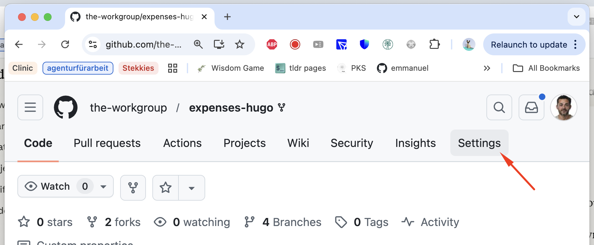


## Step 2: Switch to the Right Branch

Before we create any files, we need to make sure we are working on the correct branch.

1. Open your repository on GitHub in your browser
2. Near the top-left of the page, you will see a button that says **main** or **master** — this is the branch selector
3. Click on it and choose `feature/github-actions` from the dropdown
4. The page should refresh and now show `feature/github-actions` as the current branch

> **Why do we use a branch?** A branch lets you try out changes without affecting the main version of your project. If something goes wrong, the main branch stays safe.

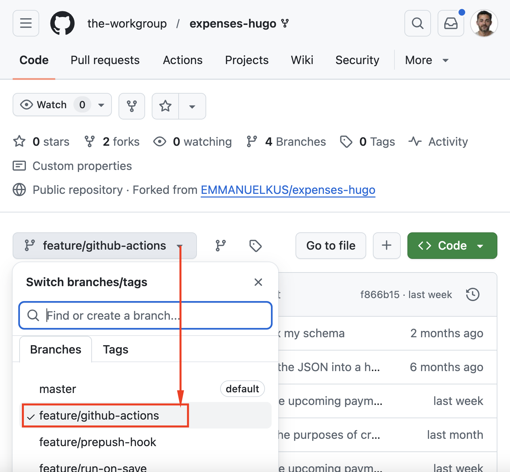

## Step 3: Create the Workflow File

GitHub Actions looks for instructions in a special folder called `.github/workflows/`. We need to create a file there.

1. While on the `feature/github-actions` branch, click the **Add file** button near the top of the page
2. Choose **Create new file**
3. In the file name box at the top, type: `.github/workflows/hugo.yml`
   - As you type the `/` characters, GitHub will automatically create the folders for you
4. Notice the right side of the page — GitHub shows you **documentation about workflow syntax**. This is a handy reference you can use anytime you are editing workflow files.

> **What is a `.yml` file?** YAML is a simple text format used for configuration files. It differs from JSON by using indentation (spaces) to show structure, instead of enclosing in brackets `[ ... ]` and curly braces `{ ... }` like JSON does. Similar to JSON, this logical language allows us to show what belongs under what (similar to your expenses JSON file).

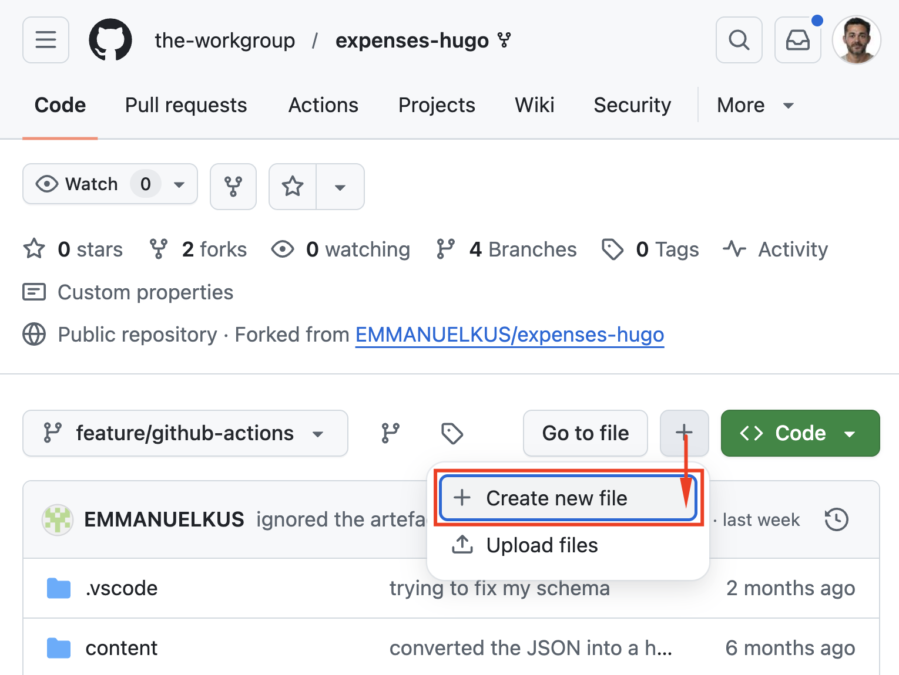

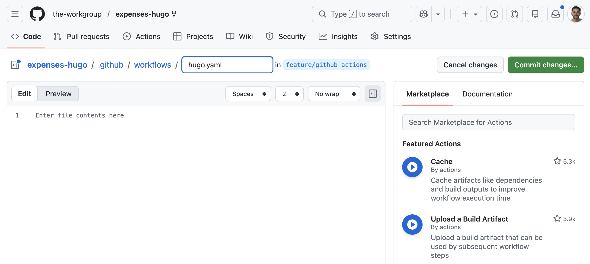

## Step 4: Paste the Workflow Contents

Copy the code below and paste it into the file editor on GitHub:

```yaml
name: Generate artifacts using Hugo, publish them using GitHub pages

on:
  push:
  workflow_dispatch:

permissions:
  contents: read
  pages: write
  id-token: write

concurrency:
  group: "pages"
  cancel-in-progress: true

defaults:
  run:
    shell: bash

jobs:
  build:
    runs-on: ubuntu-latest
    env:
      HUGO_VERSION: 0.92.0
    steps:
      - name: Install hugo
        run: |
          HUGO_RELEASES=https://github.com/gohugoio/hugo/releases/download/v${HUGO_VERSION}
          HUGO_PACKAGE=hugo_extended_${HUGO_VERSION}_Linux-64bit.deb
          wget -O ${{ runner.temp }}/hugo.deb ${HUGO_RELEASES}/${HUGO_PACKAGE} \
          && sudo dpkg -i ${{ runner.temp }}/hugo.deb
      - name: Get pushed code
        uses: actions/checkout@v4
        with:
          submodules: recursive
      - name: Prepare to run hugo
        id: pages
        uses: actions/configure-pages@v5
      - name: Run hugo
        env:
          HUGO_CACHEDIR: ${{ runner.temp }}/hugo_cache
          HUGO_ENVIRONMENT: production
        run: |
          hugo \
            --minify \
            --baseURL "${{ steps.pages.outputs.base_url }}/"
      - name: Upload generated artifacts
        uses: actions/upload-pages-artifact@v3
        with:
          path: ./public

  deploy:
    environment:
      name: github-pages
      url: ${{ steps.deployment.outputs.page_url }}
    runs-on: ubuntu-latest
    needs: build
    steps:
      - name: Put artifacts on GitHub Pages
        id: deployment
        uses: actions/deploy-pages@v4
```

Now scroll down and click the green **Commit changes** button. You can leave the default commit message or write your own.

## Step 5: Watch It Fail

As soon as you commit the file, GitHub Actions will automatically try to run the workflow. Let's go see what happens.

1. Click the **Actions** tab at the top of your repository
2. You should see a workflow run that was triggered by your commit
3. Click on it to see the details
4. You will see that the action has **failed** with a red X

The error message will say something like:

> Branch "feature/github-actions" is not allowed to deploy to github-pages due to environment protection rules.

This is not a bug in your code — it is a **security setting**. By default, GitHub only allows the main branch to deploy to GitHub Pages. This is to prevent accidental deployments from unfinished work.

To see the actual error message, follow the steps in the screenshots below:

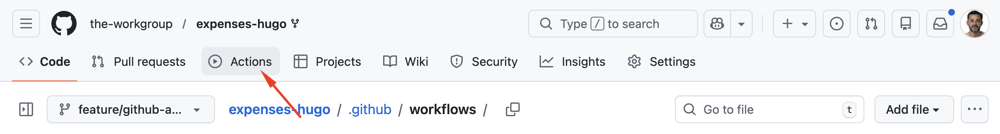

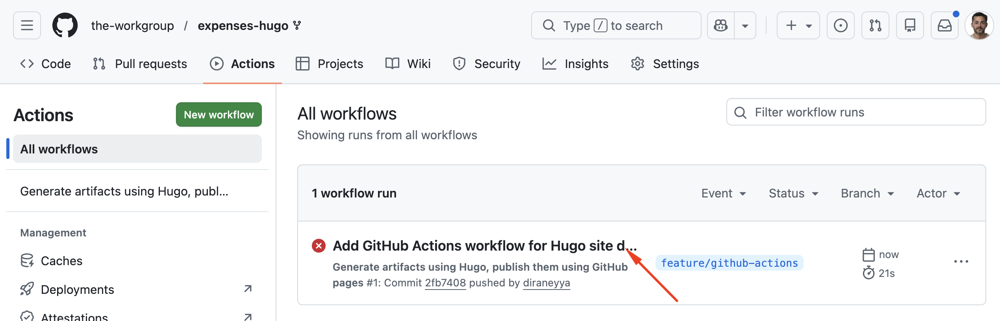

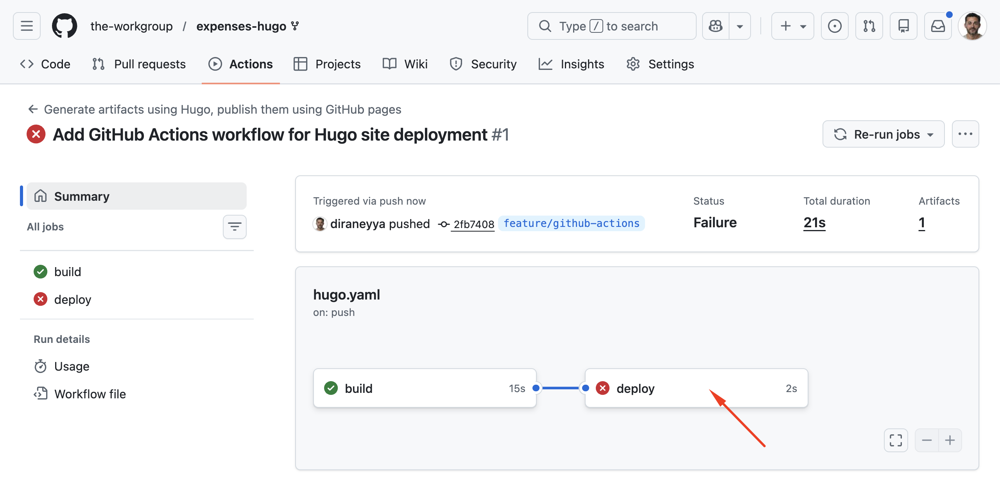

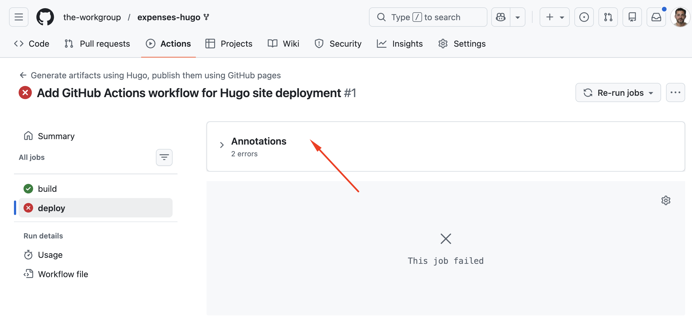

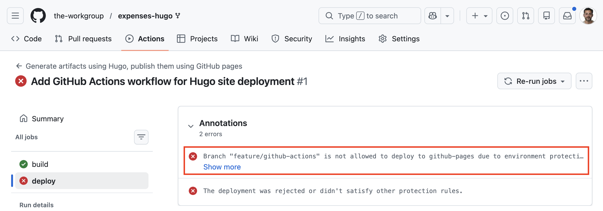

The error message is:
> Branch "feature/github-actions" is not allowed to deploy to github-pages due to environment protection rules.

Let's fix this!

## Step 6: Allow Your Branch to Deploy

Let's change this setting so our branch is allowed to deploy.

1. Go to your repository's **Settings** tab
2. In the left sidebar, click **Environments**
3. Click on **github-pages**
4. Under **Deployment branches and tags**, you will see it is set to only allow certain branches
5. Change this to **All branches** (or add `feature/github-actions` specifically)
6. Click **Save protection rules**

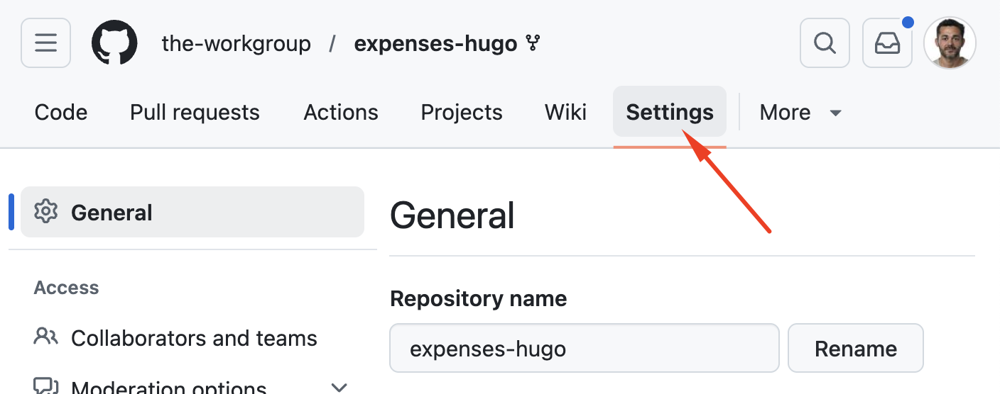

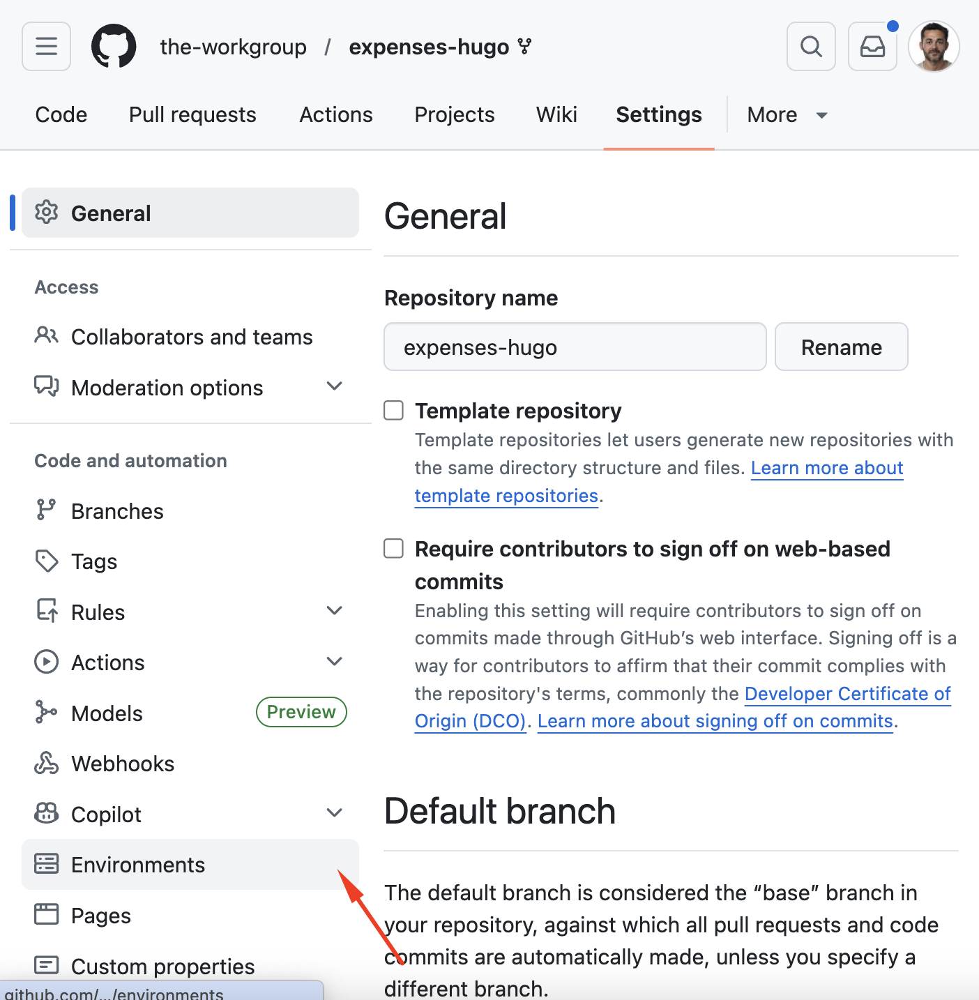

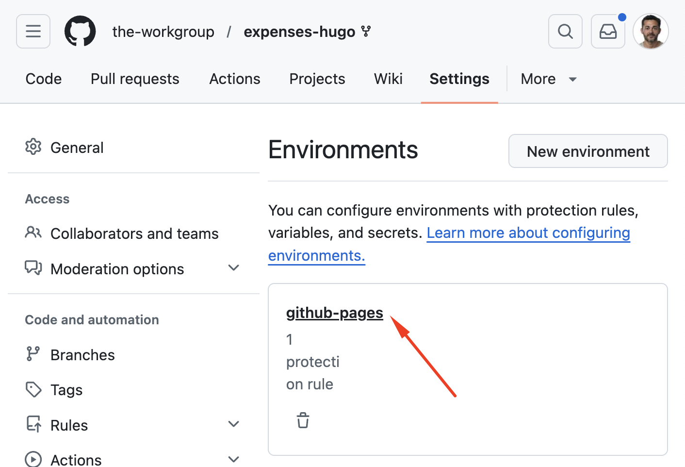

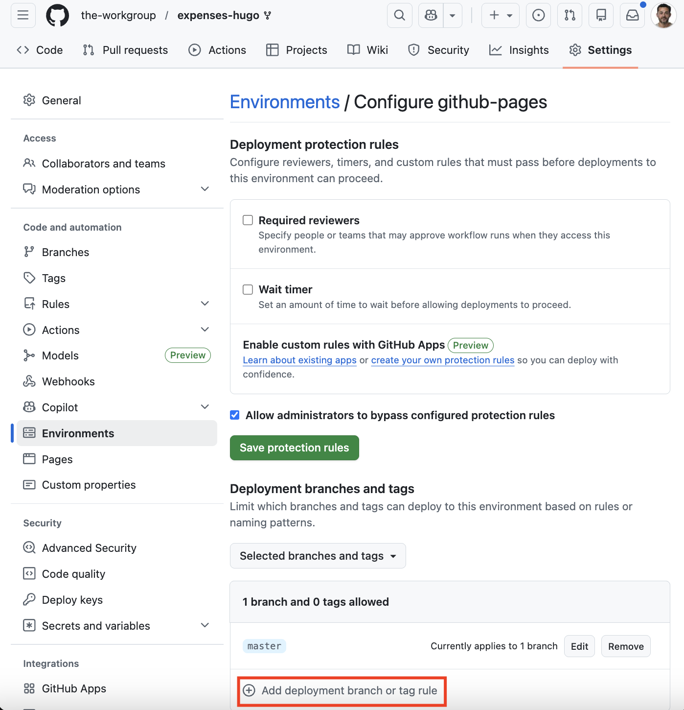

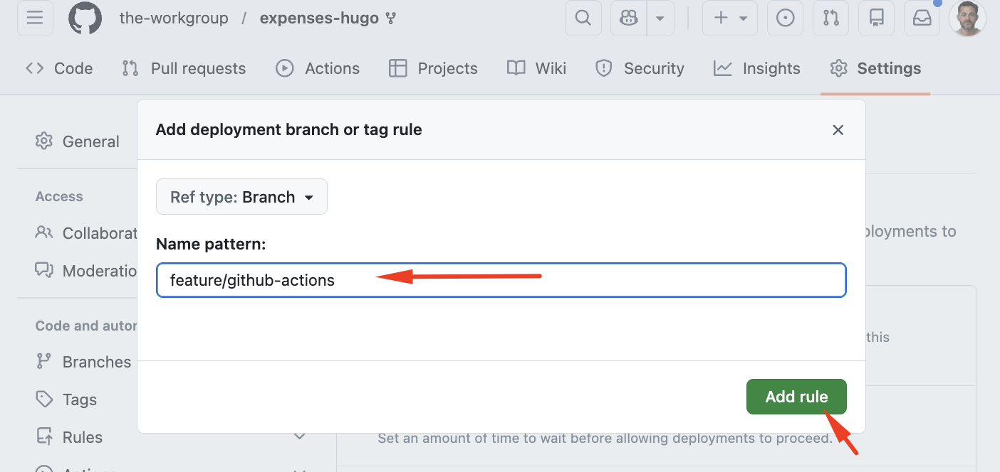

## Step 7: Trigger the Action Again

The action will not re-run on its own just because we changed a setting. We need to give it a reason to run again. The easiest way is to make a small commit.

1. Go back to **Code** tab
2. Make sure you are still on the `feature/github-actions` branch (very important!) ⚠️
3. Open any file (for example, the `README.md` or any other file)
4. Click the pencil icon to edit it
5. Add an empty line or a small comment — it does not matter what
6. Commit the change

> [!TIP]  
> You can use this as an opportunity to clean up old content from the README, for example, the following text at the end of that file is now outdated:
> ```
> ## Things we talked about today you can add to your notes
>
> - description and markdownDescription :thumbsup:
> - regular expressions :x:
> - Ctrl+Shift+O for navigating JSON data in vscode :thumbsup:
> - anyOf :thumbsup:
> - pattern :thumbsup:
> 
> ## assignment
> 
> - Add an optional property named quantity to the expense object > schema
> - Commit and push the changes in the HUGO expense project with a meaningful commit message
> - Add error to the amount and the purpose in the template and > also add quantity as a colon to the template. 
> 
> ```

This new commit will trigger the workflow again.

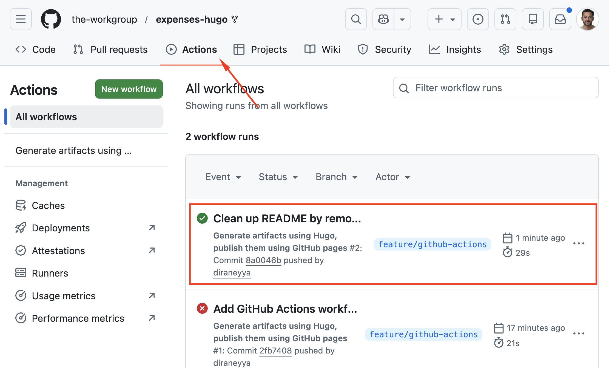

## Step 8: Check the Action Logs

1. Go to the **Actions** tab again
2. Click on the latest workflow run
3. You should see two jobs: **build** and **deploy**
4. Click on the **build** job to expand it
5. You will see each step listed by name — these match the `name:` fields in the YAML file you pasted earlier:
   - **Install hugo** — downloads and installs Hugo on the server
   - **Get pushed code** — pulls your code from the repository
   - **Prepare to run hugo** — sets up GitHub Pages configuration
   - **Run hugo** — builds your site
   - **Convert markdown to HTML** — installs pandoc and converts the output
   - **Upload generated artifacts** — packages the built site for deployment
6. Click on any step to see exactly what commands ran and what output they produced

Do not worry if you do not understand these commands, the only thing we want to show you is that these are the same commands that were specified in the GitHub actions file (committed inside of `.github/workflows` inside of the respository).

If everything went well, both jobs should show green checkmarks.

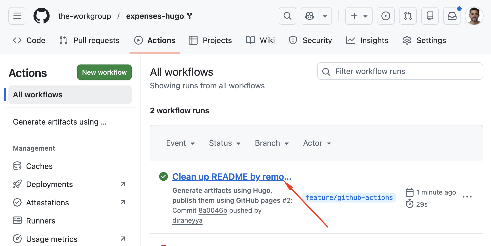

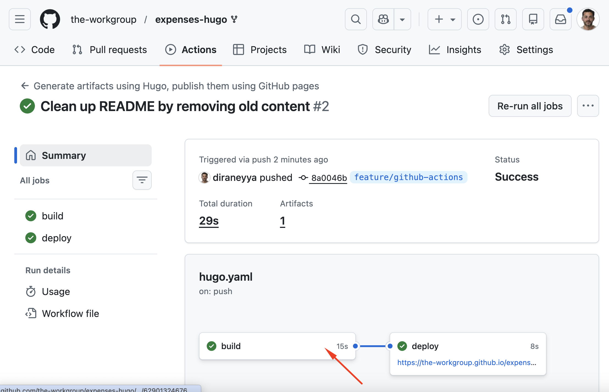

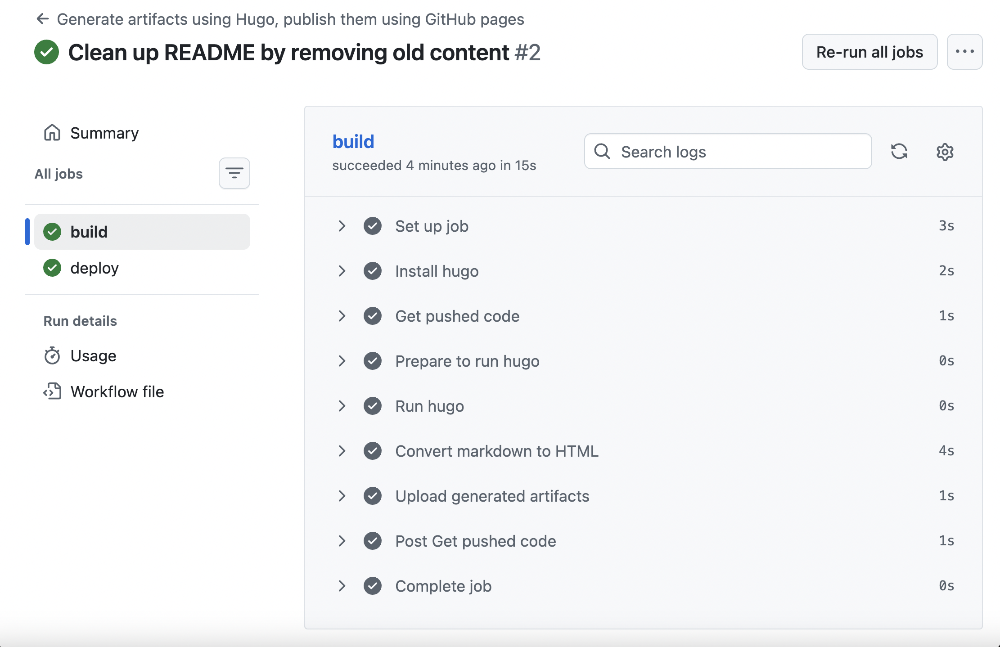

## Step 9: Visit Your Site

1. Open the URL that GitHub showed you in the previous step
2. You will probably see a blank page or a 404 error — that is okay! The site's content is not at the root path
3. Add `expense/index.md` to the end of the URL, so it looks like: `https://yourusername.github.io/expenses-hugo/expense/index.md` (remember to change `yourusername` to your GitHub username which is `emmanuekus`)
4. You should now see your expenses page

If you see your expense data displayed as a web page, congratulations — your automated deployment is working!

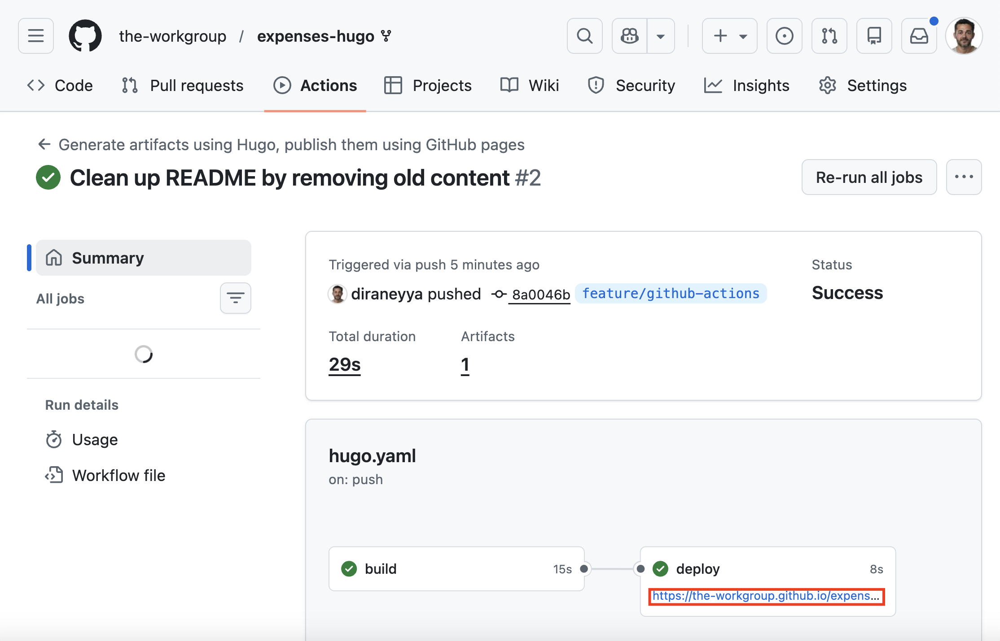

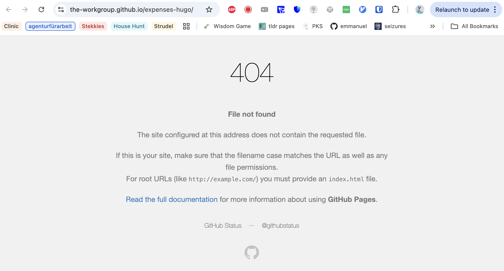

## Step 10: Wait, Why Does It Look Like Plain Text?

Look at the page you just opened. You can see the expense data, but it does not look like a proper web page. The tables are not formatted, the headings are just lines starting with `##`, and everything looks like raw text.

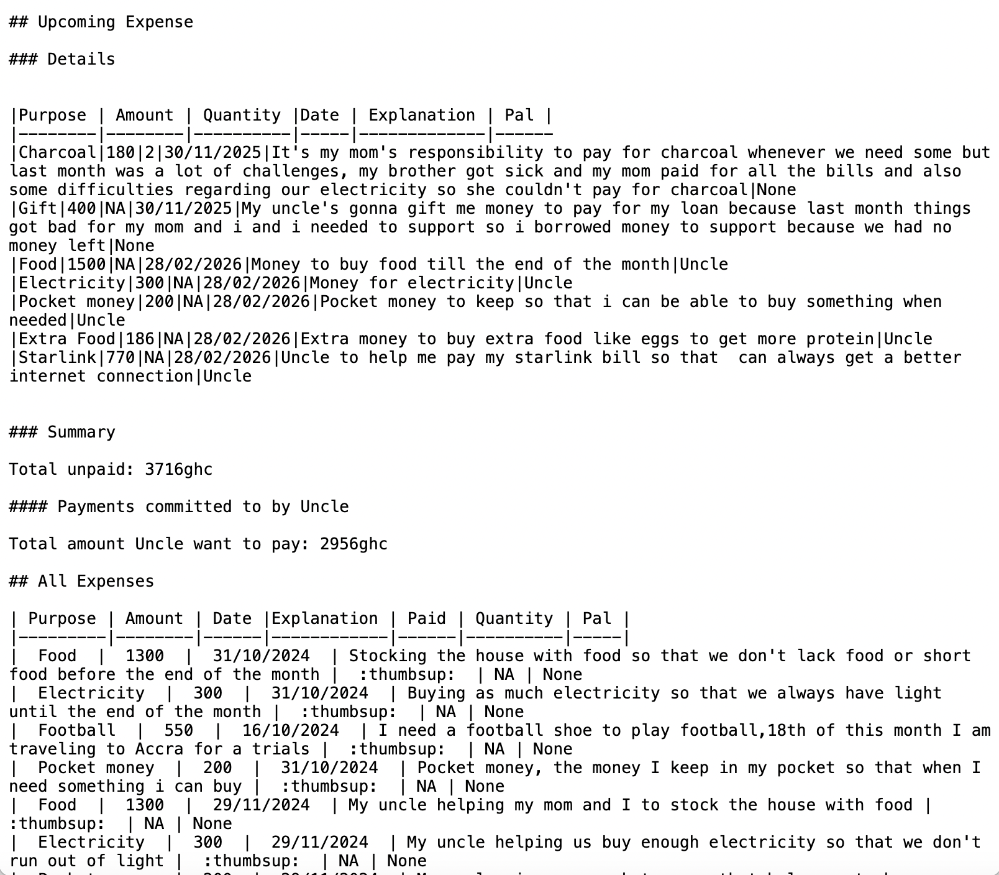

Think about these questions before moving on:

1. **What format is this file in?** The file you are looking at ends in `.md` — it is a Markdown file. Markdown is a format that humans can read easily, but it is not the language that browsers understand.

2. **What language do browsers actually understand?** Browsers are built to display **HTML** (HyperText Markup Language). When you visit any website, the browser receives HTML and uses it to build the page you see. Markdown is not HTML — so the browser just shows it as plain text.

3. **What do we need to do?** We need to **convert** the Markdown file into an HTML file before it gets deployed. That way, the browser will receive HTML and display it as a proper web page.

## Step 11: Add a Conversion Step to the Workflow

We are going to edit the workflow file to add a new step that converts Markdown to HTML using a tool called **pandoc**.

1. Go back to the **Code** tab on GitHub
2. Make sure you are on the `feature/github-actions` branch
3. Navigate to `.github/workflows/hugo.yml` and click on it
4. Click the **pencil icon** to edit the file
5. Find the lines that say:
   ```yaml
         - name: Upload generated artifacts
   ```
6. **Right before** that line, add the following new step (make sure the indentation matches the other steps — use spaces, not tabs):

   ```yaml
         - name: Convert markdown to HTML
           run: |
             sudo apt-get install -y pandoc
             pandoc public/expense/index.md -f gfm+emoji -o public/expense/index.html
   ```

7. Your file should now have this new step sitting between "Run hugo" and "Upload generated artifacts"
8. Commit the change

> **What is pandoc?** Pandoc is a tool that converts documents from one format to another. Here we are using it to convert from GitHub Flavored Markdown (`gfm`) to HTML. The `+emoji` part tells it to turn emoji codes like `:thumbsup:` into actual emoji characters. It also has a `tldr` page.

## Step 12: Check the Action and Visit Your Site Again

1. Go to the **Actions** tab and wait for the new workflow run to finish
2. Once it shows green checkmarks, open your site URL again
3. This time, go to: `https://yourusername.github.io/expenses-hugo/expense/` (remember to change `yourusername` to your GitHub username which is `emmanuekus`)
4. You should now see a properly formatted web page with real tables and headings

Notice that the URL no longer needs `index.md` at the end — browsers automatically look for `index.html` inside a folder, and that is exactly what we are now generating.

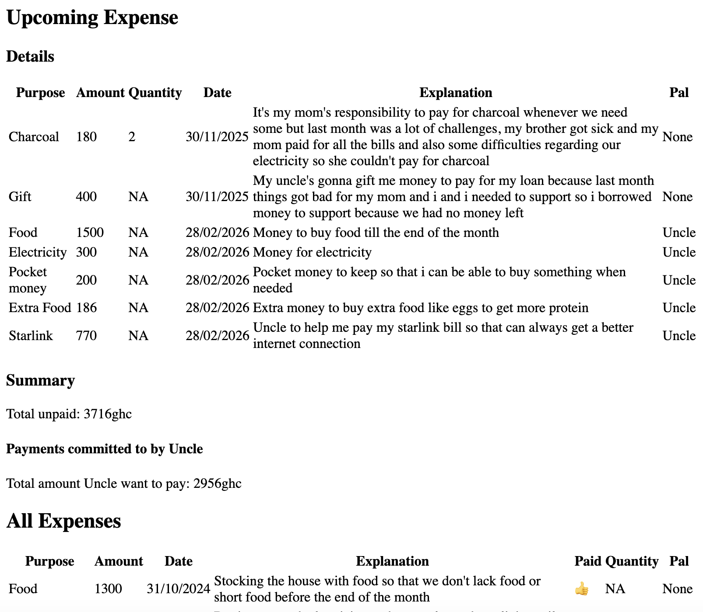

Still does not look as nice as the GitHub rendering of the page, but this can be imporoved once you start learning CSS!

## Reflection Questions

Take a moment to think about what just happened. Look at the **Actions** log from Step 8 again and compare it to the YAML file you pasted in Step 4.

1. **What triggered the action?** Look at the `on:` section at the top of the YAML file. What events cause the workflow to run? Why did it run when you committed the file?

2. **What is a "job"?** The workflow has two jobs: `build` and `deploy`. The deploy job has `needs: build` — what do you think that means? What would happen if the build job fails?

3. **Where did the site get built?** Your Hugo site did not build on your own computer. Look at `runs-on: ubuntu-latest` — what does that tell you about where the code actually ran?

4. **Follow the data.** Look at the steps in the build job. Can you trace the journey of your code? It starts in the repository, gets checked out, gets processed by Hugo into a markdown file, then gets converted to HTML by pandoc, then gets uploaded. What does each step do to transform the data?

5. **Why did it fail the first time?** The YAML file was correct, but the action still failed. What does this tell you about the difference between getting your code right and getting your settings right?

6. **How is this different from before?**